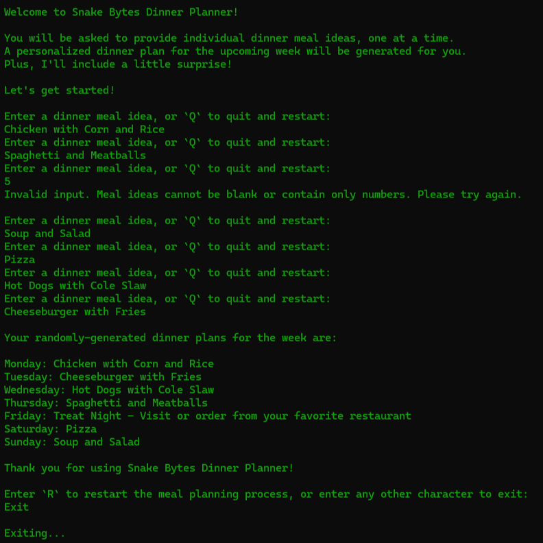

# Snake Bytes Dinner Planner - Console Edition 💻

Snake Bytes Dinner Planner is a console-based Python app that helps users generate a weekly meal plan based on their input. 🐍

Users are prompted to enter dinner meal ideas one at a time, with input validation to prevent blanks or numbers-only entries. 

Once submitted, the app shuffles the ideas and generates a 7-day meal plan, including a special "Treat Night" for a break from home cooking! 😄

## Demo Video

https://github.com/user-attachments/assets/653ff4d4-6e3f-4624-86b4-2a0e19b7622d

## Screenshot

## Getting Started

### Prerequisites
- Python 3.x

### Installation

- Fork this repository to your own GitHub account
- Clone your fork onto your local device
- Run the app with the `python3 main.py` command
- Follow the console prompts to create your weekly dinner plan 🍝